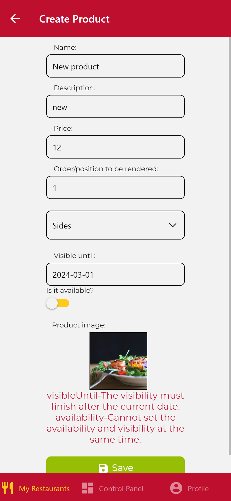
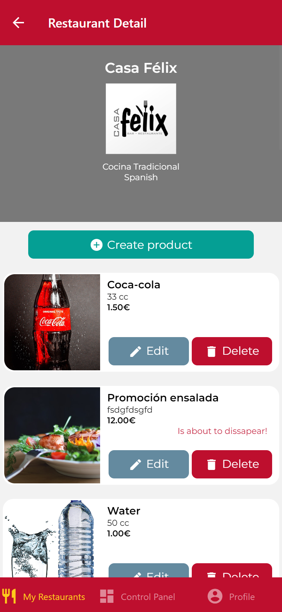

# IISSI-2 IS: Examen de laboratorio Junio 2024. 

## Productos con periodo de visibilidad. Enunciado

Una vez se ha puesto en marcha la primera versión de DeliverUS, los inversores han solicitado la inclusión de una nueva funcionalidad que consiste en ofrecer a los propietarios la posibilidad de establecer un momento en el que los productos dejarán de ser visibles (`visibleUntil`).

Un propietario podrá establecer este momento al crear o actualizar un producto con dos escenarios posibles:

* Por defecto, este momento será nulo, por lo que se considera que siempre estará visible.
* Si un propietario establece este momento, el producto solo estará visible hasta la fecha (inclusive).

Además se deben cumplir las siguientes reglas de negocio:
* Un propietario no podrá establecer un momento de fin anterior al momento actual.
* Un propierario no podrá establecer un producto como no disponible y, al mismo tiempo, un momento de fin.


Finalmente, los productos que estén a una semana o menos de desaparecer aparecerán en la interfaz marcados.

### Ejercicio 1

Realice todos los cambios necesarios en el proyecto de backend para implementar el nuevo requisito asegurándose de que los test se ejecutan correctamente.

Recuerde que puede correr los tests con:
```Bash
npm run test:backend
```

Céntrese en aquellos añadidos al archivo: `productsVisibility.test.js`.

Enlaces de ayuda:

* https://sequelize.org/docs/v6/core-concepts/assocs/#special-methodsmixins-added-to-instances
* https://sequelize.org/docs/v7/querying/operators/
* https://express-validator.github.io/docs/api/validation-chain/#isdate
* https://www.jsdocs.io/package/yup#date

### Ejercicio 2

Realice todos los cambios necesarios en el proyecto de frontend para implementar el nuevo requisito.

Puede renderizar el icono de fijado propuesto con

<div style="display: grid; grid-template-columns: repeat(2, 50%); gap: 20px;">
  
  
  
  
</div>

## Proyecto base suministrado

Este repositorio incluye el backend completo (carpeta `DeliverUS-Backend`) y el frontend de `owner` (carpeta `DeliverUS-Frontend-Owner`). Servirá como base para realizar el examen de laboratorio de la asignatura.

## Preparación del entorno

### a) Windows

* Abra un terminal y ejecute el comando `npm run install:all:win`.

### b) Linux/MacOS

* Abra un terminal y ejecute el comando `npm run install:all:bash`.

## Ejecución

### Backend

* Para **rehacer las migraciones y seeders**, abra un terminal y ejecute el comando

    ```Bash
    npm run migrate:backend
    ```

* Para **ejecutarlo**, abra un terminal y ejecute el comando

    ```Bash
    npm run start:backend
    ```

### Frontend

* Para **ejecutar la aplicación frontend de `owner`**, abra un nuevo terminal y ejecute el comando

    ```Bash
    npm run start:frontend:owner
    ```


## Depuración

* Para **depurar el backend**, asegúrese de que **NO** existe una instancia en ejecución, pulse en el botón `Run and Debug` de la barra lateral, seleccione `Debug Backend` en la lista desplegable, y pulse el botón de *Play*.

* Para **depurar el frontend**, asegúrese de que **EXISTE** una instancia en ejecución del frontend que desee depurar, pulse en el botón `Run and Debug` de la barra lateral, seleccione `Debug Frontend` en la lista desplegable, y pulse el botón de *Play*.

## Test

* Para comprobar el correcto funcionamiento de backend puede ejecutar el conjunto de tests incluido a tal efecto. Para ello ejecute el siguiente comando:

    ```Bash
    npm run test:backend
    ```
**Advertencia: Los tests no pueden ser modificados.**

## Problemas con los puertos

En ocasiones, los procesos de backend o frontend, con o sin depuración, pueden quedarse bloqueados sin liberar los puertos utilizados, impidiendo que puedan ejecutarse otros procesos. Se recomienda cerrar y volver a iniciar VSC para cerrar dichos procesos.

## Procedimiento de entrega

1. Borrar las carpetas **node_modules** de backend y frontend y **.expo** del frontend.
1. Crear un ZIP que incluya todo el proyecto. **Importante: Comprueba que el ZIP no es el mismo que te has descargado e incluye tu solución**
1. Avisa al profesor antes de entregar.
1. Cuando el profesor te dé el visto bueno, puedes subir el ZIP a la plataforma de Enseñanza Virtual. Espera a que la plataforma te muestre un enlace al ZIP antes de pulsar el botón de aceptar.
