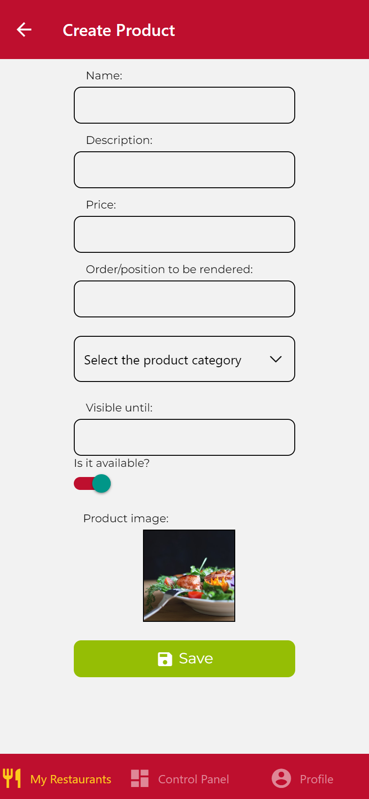
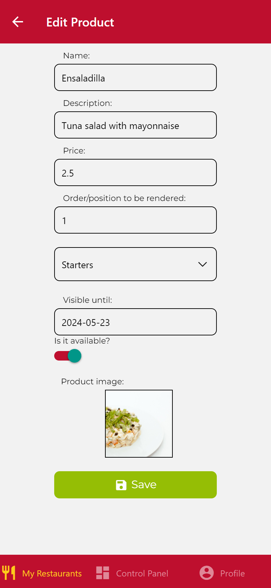

# IISSI-2 IS: Lab Exam June 2024

## Pinned Restaurants. Description

After the initial launch of DeliverUS, investors have requested a new feature that allows owners to pin their restaurants. Each owner can pin as many restaurants as they wish.

An owner can pin restaurants in two different ways:

* In the restaurant creation form. By default, it will not be pinned, but the owner can choose to pin it. To do this, a `Switch` should be provided that works with a property called `pinned`. If the `Switch` is checked, the restaurant should be created as pinned. The backend expects the `pinned` property to be a boolean and optional. If the property is not present, it should be created as not pinned.

* On the "My Restaurants" screen, through an icon that will act as a button and will be displayed next to each restaurant. By clicking it, the restaurant will be pinned or unpinned. The application should ask for confirmation from the owner when the button is pressed: use the provided `ConfirmationModal` component, similar to the `DeleteModal` component used in class. The system will inform the user if the restaurant has been pinned or unpinned.

Finally, pinned restaurants will always appear at the top of the restaurant lists presented to their owner and will be ordered by the date they were pinned (oldest first), followed by the non-pinned ones.


### Task 1

Make all the necessary changes in the backend project to implement the new requirement. The backend tests expect the route to be: `PATCH /restaurants/:restaurantId/togglePin` and that restaurants have a new property called `pinnedAt`.

Remember that you can run the tests with:
```Bash
npm run test:backend
```

### Task 2

Make all the necessary changes in the frontend project to implement the new requirement.

You can render the proposed pin icon with
```HTML
<MaterialCommunityIcons
    name={item.pinnedAt ? 'pin' : 'pin-outline'}
    color={GlobalStyles.brandSecondaryTap}
    size={24}
/>
```

### Scoring

#### Task 1 Scoring
* RF1. Ability to create a pinned or unpinned restaurant. (2 points)
* RF2. Ability to set an existing restaurant as pinned or unpinned. (2 points)
* RF3. List restaurants in the described order: first the pinned restaurants ordered by pin date (the oldest pinned restaurants must come first), and then the unpinned restaurants. (1 point)
#### Task 2 Scoring
* RF1. Ability to create a pinned or unpinned restaurant. (1 point)
* RF2. Ability to set an existing restaurant as pinned or unpinned. 
    *  RF2.1. Ability to set an existing restaurant as pinned, with confirmation and feedback about the successful pinning. (1,5 points)
    *  RF2.2. Ability to set an existing restaurant as unpinned, with confirmation and feedback about the successful unpinning. (1,5 points)
* Global. Visual correctness: icons, layout, modals etc. (1 point)

All actions/screens/etc. that cannot be human-checked (as a final user would do) due to any errors, may not be considered for scoring.

<div style="display: grid; grid-template-columns: repeat(2, 50%); gap: 20px;">
  
  
  
  
  
</div>

## About supplied base project 

This repository includes the complete backend (folder `DeliverUS-Backend`) and the `owner` frontend (folder `DeliverUS-Frontend-Owner`). It will serve as the basis for the lab exam of the course.

## Environment Setup

### a) Windows

* Open a terminal and run the command `npm run install:all:win`.

### b) Linux/MacOS

* Open a terminal and run the command `npm run install:all:bash`.

## Execution

### Backend

* To **rebuild migrations and seeders**, open a terminal and run the command

    ```Bash
    npm run migrate:backend
    ```

* To **run it**, open a terminal and run the command

    ```Bash
    npm run start:backend
    ```

### Frontend

* To **run the `owner` frontend application**, open a new terminal and run the command

    ```Bash
    npm run start:frontend:owner
    ```

## Debugging

* To **debug the backend**, ensure that there is **NO** running instance, click the `Run and Debug` button on the sidebar, select `Debug Backend` from the dropdown list, and press the *Play* button.

* To **debug the frontend**, ensure that there **IS** a running instance of the frontend you want to debug, click the `Run and Debug` button on the sidebar, select `Debug Frontend` from the dropdown list, and press the *Play* button.

## Testing

* To verify the correct functioning of the backend, you can run the included set of tests. To do this, run the following command:

    ```Bash
    npm run test:backend
    ```
**Warning: Tests cannot be modified.**

## Port Issues

Sometimes, backend or frontend processes, with or without debugging, may get stuck without releasing the used ports, preventing other processes from running. It is recommended to close and restart VSC to close such processes.

## Submission Procedure

1. Delete the **node_modules** folders from backend and frontend and the **.expo** folder from the frontend.
2. Create a ZIP that includes the entire project. **Important: Ensure that the ZIP is not the same as the one you downloaded and includes your solution**
3. Notify the instructor before submitting.
4. When the instructor gives the green light, you can upload the ZIP to the Virtual Teaching platform. Wait for the platform to show a link to the ZIP before clicking the accept button.
